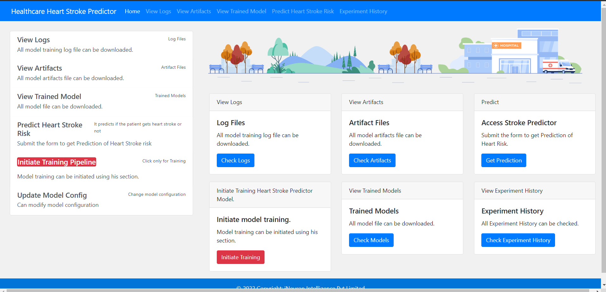
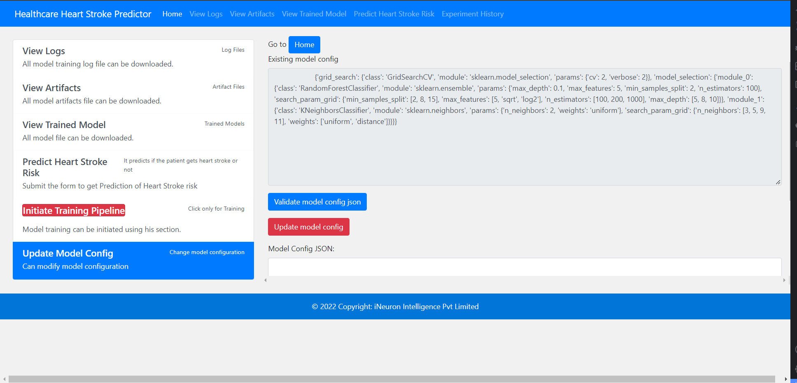
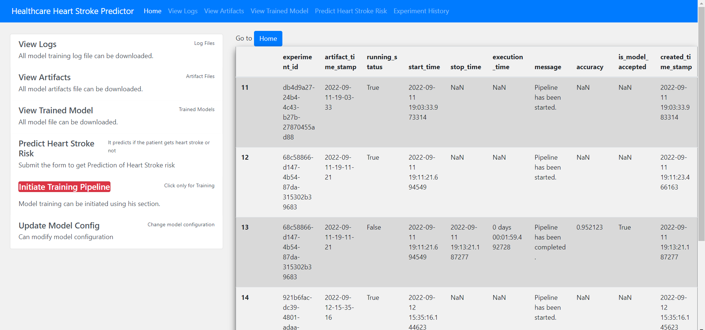

# Heart Stroke Predictor

### [Application deployment Link](https://heart-stroke-predictor-ineuron.herokuapp.com/)

### Language and Libraries

<p>
<a></a>
<a></a>
<a></a>
 <a></a>
<a></a>
<a></a>
</p>


## Data
The dataset is collected from the following link:
https://www.kaggle.com/datasets/fedesoriano/stroke-prediction-dataset

* This dataset is used to predict whether a patient is likely to get stroke based on the input parameters like gender, age, various diseases, and smoking status.

## Data Understanding
The dataset used to predict stroke is a dataset from Kaggle. This dataset has been used to predict stroke with 566 different model algorithms. This dataset has:
- 5110 samples or rows
- 11 features or columns 
- 1 target column (stroke).

## About Project:
This project aims to solve the problem of Healthcare clinics where they can predict if a patient is likely to get heart stroke based on diagnostic report, the model is done  Using Sklearn's supervised machine learning techniques. It is a Classification problem and training are carried out on dataset of previous patients with their diagnostic report with age, gender and history of other disease. Several classification techniques have been studied, the model has been finalized with Random forest and K-Nearest Neighbors in pipeline.

For Detailed EDA and Feature engineering Check out notebook directory 

Their performances were compared in order to determine which one works best with our dataset and used them to predict if patient will get heart stroke or not from user input from Flask application.

#### Dataset is taken from Kaggle and stored in github as well as inside notebook directory 


## Features in Datasets:
1. `id` : a unique identifier that distinguishes each data [int]
2. `Gender`: Patient's gender ('Male', 'Female', and 'Other') [str]
3. `age` : Age of the patient [int]
4. `Hypertension`: Hypertension or high blood pressure is a disease that puts a person at risk for stroke. 0 if the patient does not have hypertension, 1 if the patient has hypertension. [int]
5. `heart_disease`: Heart disease is a disease that puts a person at risk for stroke. 0 if the patient does not have heart disease, 1 if the patient has heart disease. [int]
6. `ever_married` : Describes whether the patient is married or not ('Yes' or 'No') [str]
7. `work_type` : Type of employment or status ('children' for children, 'Govt_job' for civil servants, 'Never_worked' for those who have never worked, 'Private' or 'Self-employed' for entrepreneurs or freelancers) [str]
8. `Residence_type` : Condition of residence ('Rural' for rural areas and 'Urban' for urban areas) [str]
9. `avg_glucose_level` : Average amount of glucose (sugar) in the blood [float]
10. `bmi` : Body Mass Index to measure the stability of body weight with height. [float]
11. `smoking_status` : Description of smoking ('formerly smoked' for those who have smoked, 'never smoked' for those who have never smoked, 'smokes' for those who smoke, and 'unknown' for those whose smoking status is unknown) [str]

💿 Installing
1. Environment setup.
```
conda create --prefix venv python==3.9 -y
```
```
conda activate venv/
````
2. Install Requirements and setup
```
pip install -r requirements.txt
```
5. Run Application
```
python app.py
```

## 🔧 Built with
- Flask
- Python 3.9
- Machine learning
- Scikit learn
- 🏦 Industrial Use Cases

## Models Used
* Logistic Regression
* KNeighbors Classifier
* XGB Classifier
* CatBoost Classifier
* SVC
* AdaBoost Classifier
* RandomForest Classifier

From these above models after hyperparameter optimization we selected Top two models which were XGBRegressor and Random Forest Regressors and used the following in Pipeline.

* GridSearchCV is used for Hyperparameter Optimization in the pipeline.

* Any modification has to be done in  Inside Config.yaml which can be done in route **/update_model_config**

## `heart_stroke` is the main package folder which contains 

**Artifact** : Stores all artifacts created from running the application

**Components** : Contains all components of Machine Learning Project
- DataIngestion
- DataValidation
- DataTransformations
- ModelTrainer
- ModelEvaluation
- ModelPusher

**Custom Logger and Exceptions** are used in the Project for better debugging purposes.

## 📷 Application Screenshots
### **This is the screenshot of the final Webpage which was done using the Flask**


### **This is the screenshot of the webpage which gets user input for prediction**


### **This is the screenshot of the page in which user can change the model parameters for the experiment**


### **This is the screenshot of the page where u can check the experiment history**


## Conclusion
- This Project can be used in real-life by Health Clinics to predict if the user has chance of heart stroke or not.
- Can be implemented in hospital website to predict the chance of heart stroke for the patients.
- As heart diseases and strokes are increasing rapidly across the world and causing deaths, it becomes necessary to develop an efficient system that would predict the heart stroke effectively before hand so that immediate medical attention can be given. In the proposed system, the most effective algorithm for stroke prediction was obtained after comparative analysis of the accuracy scores of various models.

==============================================================================================================================


